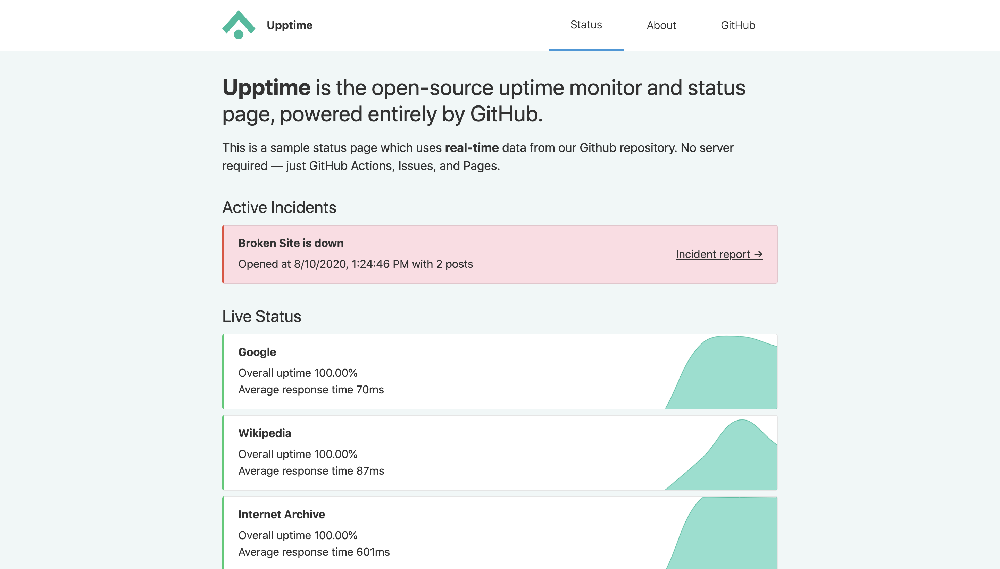
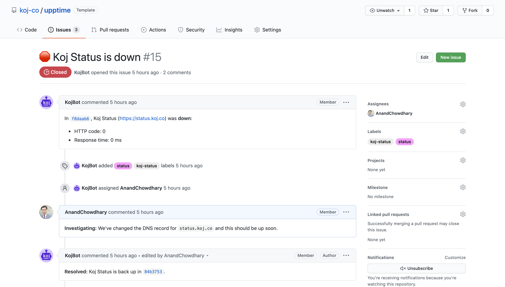
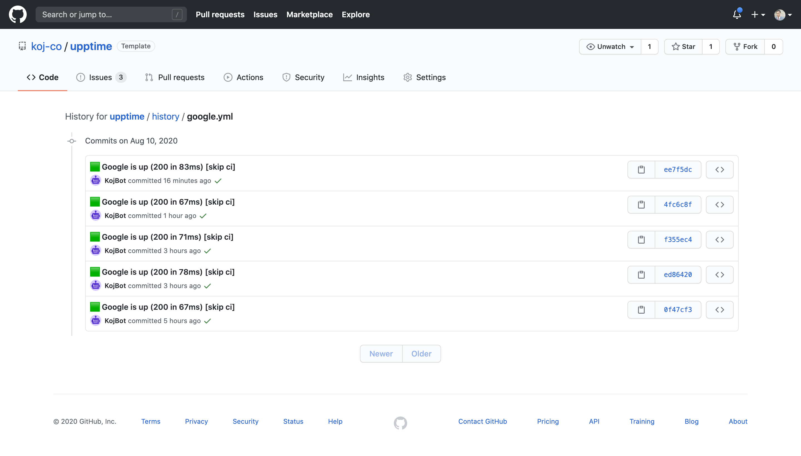
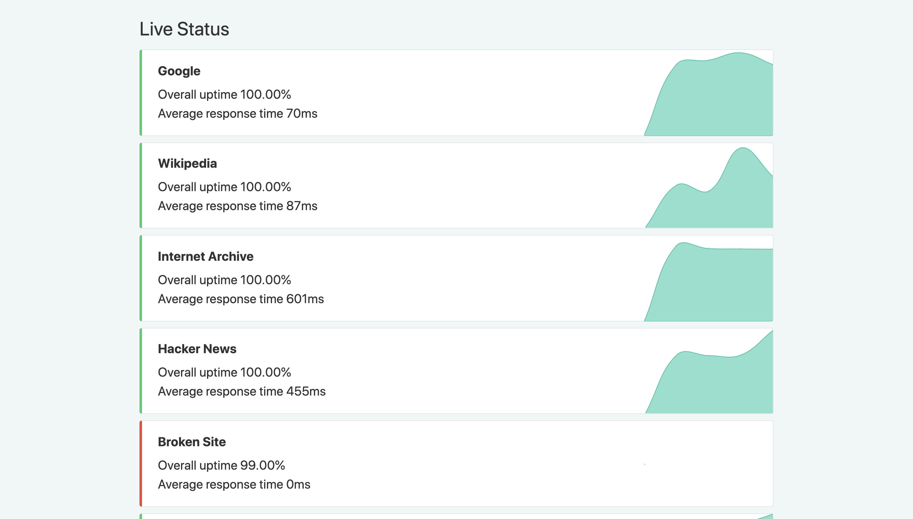

# 

Upptime is the open-source uptime monitor and status page, powered entirely by GitHub Actions and Issues.

[](https://github.com/koj-co/upptime/actions?query=workflow%3A%22Static+Site+CI%22)
[](https://github.com/koj-co/upptime/actions?query=workflow%3A%22Graphs+CI%22)
[](https://github.com/koj-co/upptime/actions?query=workflow%3A%22Response+Time+CI%22)
[](https://github.com/koj-co/upptime/actions?query=workflow%3A%22Summary+CI%22)
[](https://github.com/koj-co/upptime/actions?query=workflow%3A%22Uptime+CI%22)

Live status: <!--live status--> **🟨 Partial outage**

## ⭐ How it works

- GitHub Actions is used as an uptime monitor
  - Every 5 minutes, a workflow visits your website to make sure it's up
  - Response time is recorded every 6 hours and committed to git
  - Graphs of response time are generated every day
- GitHub Issues are used for incident reports
  - An issue is opened if an endpoint is down
  - People from your team are assigned to the issue
  - Incidents reports are posted as issue comments
  - Issues are locked so non-members cannot comment on them
  - Issues are closed automatically when your site comes back up
- GitHub Pages are used for the status website
  - A simple, beautiful, and accessible PWA is generated
  - Built with Svelte and Sapper
  - Fetches data from this repository using the GitHub API



## 📈 Status

This section automatically updates every day and when the status of any website changes:

<!--start: status pages-->

<!--end: status pages-->

## 👩‍💻 Getting started

1. Create a new repository [using this template](https://github.com/koj-co/upptime/generate)
2. Update the [`.statusrc.yml`](./.statusrc.yml) file with your configuration
3. Enable publishing the `gh-pages` branch for your status website

### Concepts

#### Issues as incidents

When the GitHub Actions workflow detects that one of your URLs is down, it automatically opens a GitHub issue ([example issue #15](https://github.com/koj-co/upptime/issues/15)). You can add incident reports to this issue by adding comments. When your site comes back up, the issue will be closed automatically as well.

<table>
  <tr>
    <td>
      
    </td>
    <td>
      
    </td>
  </tr>
</table>

#### Commits for response time

Four times per day, another workflow runs and records the response time of your websites. This data is commited to GitHub, so it's available in the commit history of each file. Then, the GitHub API is used to graph the response time history of each endpoint and to track when a site went down.

<table>
  <tr>
    <td>
      
    </td>
    <td>
      
    </td>
  </tr>
</table>

### Configuration

The [`.statusrc.yml`](./.statusrc.yml) file is used as the central configuration for Upptime, with this syntax:

```yaml
owner: koj-co # GitHub username
repo: upptime # GitHub repository name
user-agent: koj-co
sites: # List of endpoints to track
  - name: Google
    url: https://www.google.com
assignees: # Users to assign downtime issues (optional)
  - AnandChowdhary
status-website: # Status website (optional)
  cname: upptime.js.org # Custom domain CNAME
  name: Upptime # Status website title
```

#### Repository

A GitHub repository is used as the "source of truth" for your uptime logs, and the static site uses the GitHub API and fetches data from this repository.

After you've created a new repository using this template (see [Creating a repository from a template](https://docs.github.com/en/github/creating-cloning-and-archiving-repositories/creating-a-repository-from-a-template)), specify the username and repository name in the configuration:

```yaml
owner: koj-co
repo: upptime
```

#### Endpoints

You can track as many websites as you like. Add the names and URLs of your endpoints in the `sites` key:

```yaml
sites:
  - name: Google
    url: https://www.google.com
  - name: DuckDuckGo
    url: https://duckduckgo.com
```

To make `POST` requests (or any other HTTP verb), you can add the `method` key:

```yaml
sites:
  - name: POST to Google
    url: https://www.google.com
    method: POST
  - name: DELETE Example
    url: https://example.com
    method: DELETE
```

#### User agent

Requests made to the GitHub API must include a valid `User-Agent` header (see [User Agent required](https://docs.github.com/en/rest/overview/resources-in-the-rest-api#user-agent-required)). It is recommended to use your GitHub username here:

```yaml
user-agent: your-github-username
```

#### Assignees

You can add members of your team to be assigned to every downtime issue:

```yaml
assignees:
  - AnandChowdhary
  - CarloBadini
```

If you want particular users to be assigned per-site, you can add `assignees` under each entry in `sites`:

```yaml
sites:
  - name: Google
    url: https://www.google.com
    assignees:
      - AnandChowdhary
```

#### Branding

A static website with PWA is also generated, and you can customize the logo and name in the navbar:

```yaml
status-website:
  name: Upptime
  logoUrl: https://example.com/image.jpg
```

If you want to add a custom domain, you can add the `cname` key:

```yaml
status-website:
  name: Upptime
  logoUrl: https://example.com/image.jpg
  cname: upptime.js.org # Custom CNAME
```

#### Intro text

Optionally, you can add some introductory text to the website. You can use Markdown:

```yaml
status-website:
  introTitle: "**Upptime** is the open-source uptime monitor and status page, powered entirely by GitHub."
  introMessage: This is a sample status page which uses **real-time** data from our [Github repository](https://github.com/koj-co/upptime). No server required — just GitHub Actions, Issues, and Pages.
```

## 📄 License

- Code: [MIT](./LICENSE) © [Koj](https://koj.co)
- Data in the `./history` directory: [Open Database License](https://opendatacommons.org/licenses/odbl/1-0/)
