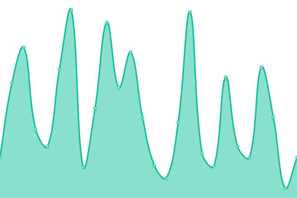
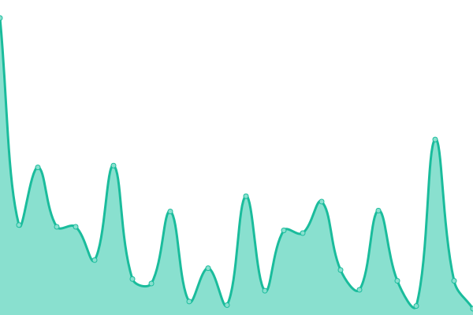
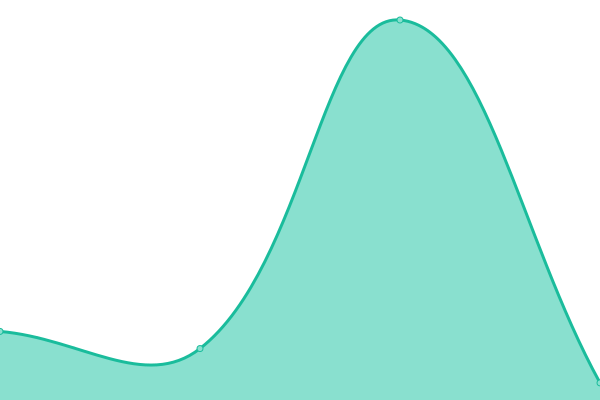
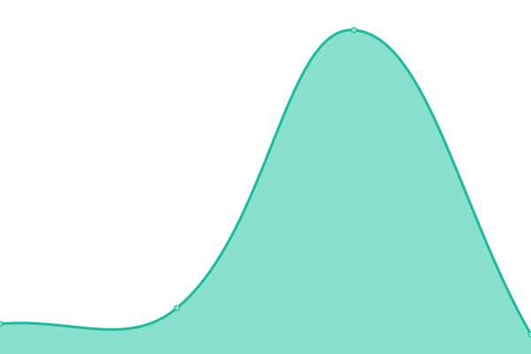

# ⬆️ Koj Status

This repository uses GitHub Actions as an uptime monitor to track the status of Koj websites.

Live status: <!--live status--> **🟩 All systems operational**

## ⭐ How it works

- Every 5 minutes, a GitHub Actions workflow tries to visit our websites
- It records the response time and commits it for git history
- If a site is down, an issue is opened and `CODEOWNERS` are tagged
- This README shows the status summary and average response time
- Our static status site uses the GitHub API to generate our status site

If you want your own GitHub Actions-powered uptime monitor, [use this template](https://docs.github.com/en/github/creating-cloning-and-archiving-repositories/creating-a-repository-from-a-template) or fork this repository, change the `./statusrc.yml` file with the URLs to visit, and enable Actions.

## 📈 Status

<!--start: status pages-->

| URL | Status | History | Response Time | Uptime |
| --- | ------ | ------- | ------------- | ------ |
| [Koj.co](https://koj.co) | 🟩 Up | [koj-co.yml](https://github.com/koj-co/status/commits/master/history/koj-co.yml) |  324ms | 100.00%
| [Koj CDN](https://kojcdn.com) | 🟩 Up | [koj-cdn.yml](https://github.com/koj-co/status/commits/master/history/koj-cdn.yml) |  519ms | 100.00%
| [URL Shortener](https://go.koj.co) | 🟩 Up | [url-shortener.yml](https://github.com/koj-co/status/commits/master/history/url-shortener.yml) |  122ms | 100.00%
| [Koj Status](https://status.koj.co) | 🟩 Up | [koj-status.yml](https://github.com/koj-co/status/commits/master/history/koj-status.yml) |  114ms | 100.00%
| [Koj Analytics](https://analytics.koj.co) | 🟩 Up | [koj-analytics.yml](https://github.com/koj-co/status/commits/master/history/koj-analytics.yml) |  270ms | 100.00%
| [Koj API](https://api.koj.co) | 🟩 Up | [koj-api.yml](https://github.com/koj-co/status/commits/master/history/koj-api.yml) |  269ms | 100.00%

<!--end: status pages-->

## 📄 License

- Code: [MIT](./LICENSE) © [Koj](https://koj.co)
- Data in the `./history` directory: [Open Database License](https://opendatacommons.org/licenses/odbl/1-0/)
