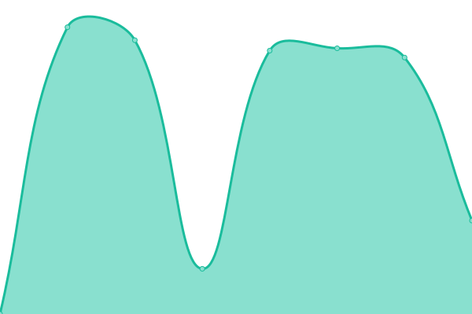

# [📈 Live Status](https://TK-TIPX.github.io/upptime): <!--live status--> **所有系統正常運作**

This repository contains the open-source uptime monitor and status page for [TK-TIPX](https://TK-TIPX.github.io/upptime), powered by [Upptime](https://github.com/upptime/upptime).

With [Upptime](https://upptime.js.org), you can get your own unlimited and free uptime monitor and status page, powered entirely by a GitHub repository. We use [Issues](https://github.com/TK-TIPX/upptime/issues) as incident reports, [Actions](https://github.com/TK-TIPX/upptime/actions) as uptime monitors, and [Pages](https://TK-TIPX.github.io/upptime) for the status page.

<!--start: status pages-->
<!-- This summary is generated by Upptime (https://github.com/upptime/upptime) -->
<!-- Do not edit this manually, your changes will be overwritten -->
<!-- prettier-ignore -->
| URL | Status | History | Response Time | Uptime |
| --- | ------ | ------- | ------------- | ------ |
|  [德明財經科技大學 TIP](https://netinfo.takming.edu.tw/tip) | 正常 | [tip.yml](https://github.com/TK-TIPX/upptime/commits/HEAD/history/tip.yml) | 

 1139毫秒
     
 | 

<a href="https://TK-TIPX.github.io/upptime/history/tip">99.83%</a>
    

|  [德明財經科技大學 TIPX](https://tip.sao-x.com) | 正常 | [tipx.yml](https://github.com/TK-TIPX/upptime/commits/HEAD/history/tipx.yml) | 

 2392毫秒
     
 | 

<a href="https://TK-TIPX.github.io/upptime/history/tipx">100.00%</a>
    

|  [德明財經科技大學 宿舍網站 dormitory](https://takming.sao-x.com) | 正常 | [dormitory.yml](https://github.com/TK-TIPX/upptime/commits/HEAD/history/dormitory.yml) | 

 180毫秒
     
 | 

<a href="https://TK-TIPX.github.io/upptime/history/dormitory">100.00%</a>
    

<!--end: status pages-->

[**Visit our status website →**](https://TK-TIPX.github.io/upptime)

## 📄 License

- Powered by: [Upptime](https://github.com/upptime/upptime)
- Code: [MIT](./LICENSE) © [TK-TIPX](https://TK-TIPX.github.io/upptime)
- Data in the `./history` directory: [Open Database License](https://opendatacommons.org/licenses/odbl/1-0/)
