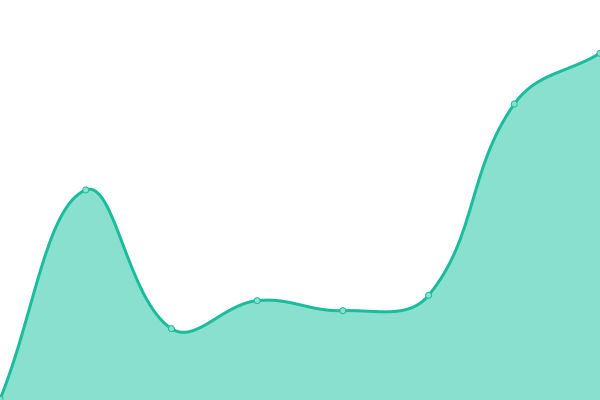
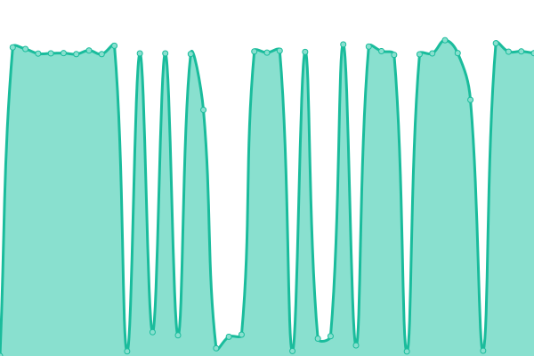
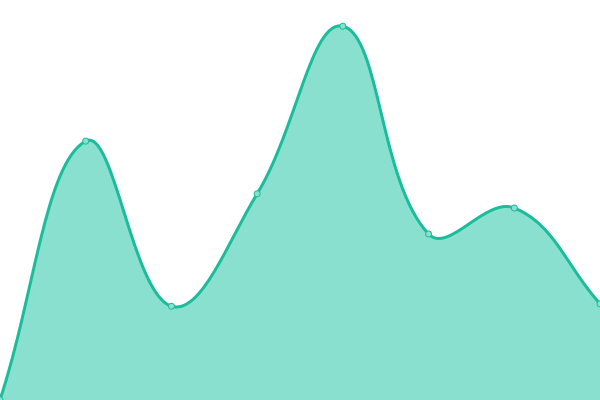
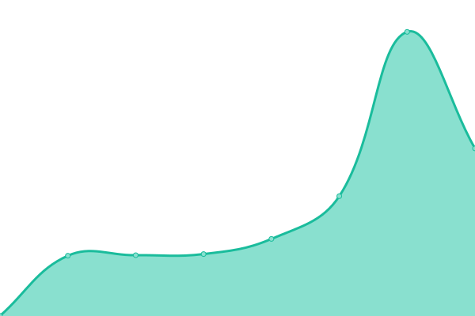
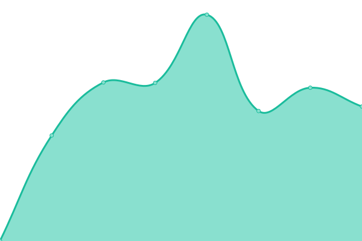

# [📈 Live Status](https://status.ideias.casa): <!--live status--> **🟩 All systems operational**

This repository contains the open-source uptime monitor and status page for [Casa Das Idéias](https://ideias.casa), powered by [Upptime](https://github.com/upptime/upptime).

With [Upptime](https://upptime.js.org), you can get your own unlimited and free uptime monitor and status page, powered entirely by a GitHub repository. We use [Issues](https://github.com/ideiascasa/status/issues) as incident reports, [Actions](https://github.com/ideiascasa/status/actions) as uptime monitors, and [Pages](https://status.ideias.casa) for the status page.

<!--start: status pages-->
<!-- This summary is generated by Upptime (https://github.com/upptime/upptime) -->
<!-- Do not edit this manually, your changes will be overwritten -->
<!-- prettier-ignore -->
| URL | Status | History | Response Time | Uptime |
| --- | ------ | ------- | ------------- | ------ |
|  [Site](https://ideias.casa/) | 🟩 Up | [site.yml](https://github.com/ideiascasa/status/commits/HEAD/history/site.yml) | 

 364ms
     
 | 

<a href="https://status.ideias.casa/history/site">100.00%</a>
    

|  [Site BR](https://www.casaideias.com.br/) | 🟩 Up | [site-br.yml](https://github.com/ideiascasa/status/commits/HEAD/history/site-br.yml) | 

 3751ms
     
 | 

<a href="https://status.ideias.casa/history/site-br">100.00%</a>
    

|  [Workflow](https://work.ideias.casa/healthz/readiness) | 🟩 Up | [workflow.yml](https://github.com/ideiascasa/status/commits/HEAD/history/workflow.yml) | 

 699ms
     
 | 

<a href="https://status.ideias.casa/history/workflow">100.00%</a>
    

|  [Dados (Noco)](https://dados.ideias.casa/dashboard/) | 🟩 Up | [dados-noco.yml](https://github.com/ideiascasa/status/commits/HEAD/history/dados-noco.yml) | 

 698ms
     
 | 

<a href="https://status.ideias.casa/history/dados-noco">100.00%</a>
    

|  [Metabase](https://meta.ideias.casa/) | 🟩 Up | [metabase.yml](https://github.com/ideiascasa/status/commits/HEAD/history/metabase.yml) | 

 1191ms
     
 | 

<a href="https://status.ideias.casa/history/metabase">100.00%</a>
    

<!--end: status pages-->

[**Visit our status website →**](https://status.ideias.casa)

## 📄 License

- Powered by: [Upptime](https://github.com/upptime/upptime)
- Code: [MIT](./LICENSE) © [Anand Chowdhary](https://anandchowdhary.com), supported by [Pabio](https://pabio.com)
- Data in the `./history` directory: [Open Database License](https://opendatacommons.org/licenses/odbl/1-0/)
